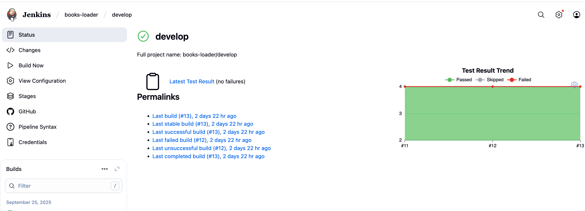
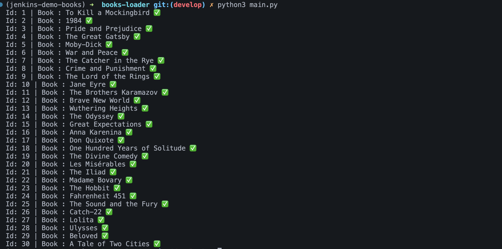

# 📚 Books Loader Microservice

**Books Loader** is a microservice that enables seamless, automated distribution of book data to other services in your architecture, making it a reliable backbone for larger systems like e-commerce platforms, recommendation engines, or content management systems.
 

### Key Features
- Reads book data from `books.json` automatically  
- Sends books to a **RabbitMQ** queue 
- Fully containerized for consistent deployment  
- Unit tested using Python testing framework
- Automated CI/CD multibranch pipeline with **Jenkins** and DockerHub  

## 👨🏻‍💻 Project's structure

```text
.
├── books.json         # Source books data
├── main.py            # Microservice entry point
├── test_main.py       # Microservice test file
├── requirements.txt   # Python dependencies
├── Dockerfile
├── Dockerfile.test
├── Jenkinsfile
├── screenshots
├── reports            # Test reports
└── README.md


```

---
## 🧑🏽‍💻 Pre-requisites

- Python >= 3.12  
- RabbitMQ server (or access to a RabbitMQ instance)  
- Docker & DockerHub account  
- Jenkins with docker hub credentials set.

---

## CI/CD (Jenkins + DockerHub)

1. Pulls the repository

2. Builds the Docker image

3. Performs Unit tests

4. Pushes the Docker image to DockerHub (preparing it for deployment)

## 📸 Screenshots

### 🔹 Jenkins


### 🔹 Docker Hub image repository


### 🔹 RabbitMQ queue 



## Installation
**Clone the repository:**
```bash
git clone https://github.com/sakkoumhamza/books-loader-microservice.git
cd books-loader-microservice
```
**Create and activate virtual environment**
```bash 
# Create a virtual environment named 'venv'
python3 -m venv venv

# Activate it (Linux/macOS)
source venv/bin/activate

# Activate it (Windows PowerShell)
venv\Scripts\Activate.ps1
```
**Install dependencies:**
```bash
pip install -r requirements.txt
```
**Running the service:**
```bash 
python main.py
```
---
## 🐳 Docker Setup

**Build the image**

```bash
docker build -t yourdockerhubusername/books-loader:latest .
```

 **Run the container**

```bash
docker run yourdockerhubusername/books-loader:latest
```

## 🫂 Contributing
``` text
1. Fork the repository

2. Create a feature branch (git checkout -b feature/new-feature)

3. Commit your changes (git commit -m 'Add new feature')

4. Push to your branch (git push origin feature/new-feature)

5. Open a Pull Request
```
 